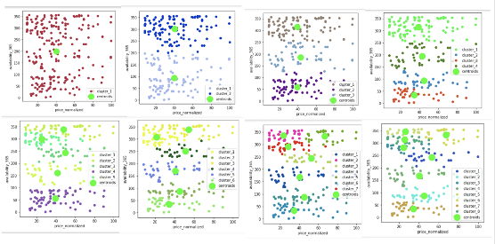

# K-Means-Clustering-From-Scratch
Data Mining: Using K-Means clustering to gain inisghts on an Airbnb dataset from [Kaggle](https://www.kaggle.com/dgomonov/new-york-city-airbnb-open-data)

## Background

This K-Means algorithm is written specifically for an input pandas DataFrame. 

#### Notes about K-Means:

#### Pros

a. Simple, easy to implement \
b. Efficient \
c. Often terminates at local optimum \
d. Works well in practice \
e. If we start frommg good initial point we may converge faster 

#### Cons

a. Applicable to only objects in continuous n-dim space \
b. Does not work with categorical data (unless transformed) \
c. Need to specify K in advance \
d. Sensitive to noisy data and outliers \
e. Good when clusters are Gaussian \
f. Each time we run algorithm, we may get different answer since we start at random k \
g. You might have an empty cluster due to bad starting point 

#### Algorithm:

Initialize cluster centroids: \
a. Pick k points at random and set as centroids represented each cluster \
Repeat while cluster assignments don't change \
b. Assign each point to nearest centroid b. Given new assignments, compute new cluster centroids as mean of all possible \
points in cluster 

1) What neighborhoods are the most expensive? 
2) What room_types are most desirable? 
3) Cluster listing based on room_type / price / num_reviews (popularity)

## Getting Started

#### 1. Install Python 3

```brew install python3```

## Running the Code 

The ```KMeansAlgorithm.py``` will run the algorithm using [this](https://www.kaggle.com/dgomonov/new-york-city-airbnb-open-data) Airbnb dataset. 

The command line arguments require (1) K clusters (int) and (2) number of iterations (int). A good number of iterations is 
100 for the stopping criterion. When the centroids remain the same after iterations, this signifies convergence. Below is 
and example of running the algorithm with 4 clusters and 100 iterations. 

In command line, run: 
```python KMeansAlgorithm.py 4 100```

## Sample Output: 

K-Means Plot with K=4 clusters: 



Elbow Plot with K=4 clusters: 


